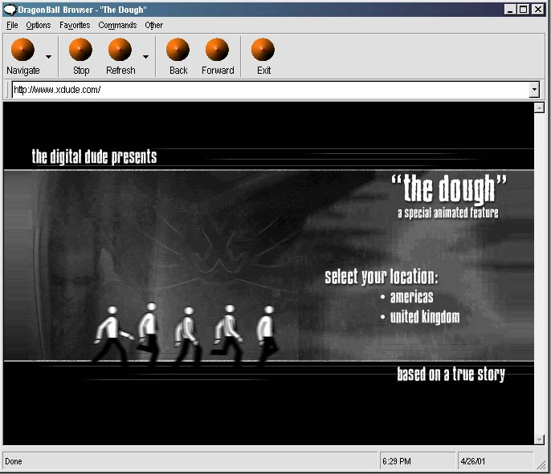



## Complete Dynamic WebBrowser

### Description

This program, DragonBall Browser by name, is a complete webbrowser with most of the functions you would ever hope to find in one. From Print Preview to a Favorites Manager, this browser has everything.

It uses the Microsoft provided WebBrowser control. Originally intended to be sold to www.pojo.com (hence the startup home page), this 'DragonBall Browser' has all the practical features.

This program has many things to learn from it. First of all it demonstrates many web browser features, including some innovative ones - Saving pages as HTML files, printing, print preview, page setup, read from cache (less load time), write to cache (for reading later on), enable / disable popups (popular with advertisement sites), work online / offline, choosing interface font, saving / reading all these settings into a .ini file, favorites menu with save feature to .dbz files, visit home page, includes quick links to popular websites (additional ones can be added with ease), view source on a webpage, retrieve web page properties, navigate to sites (choose to open in a new window), refresh site (full refresh, standard refresh, or quick, expire refresh), stop, back, and forward. On top of these concepts, the user familiarizes himself with the WebBrowser controls, resizing window (and therefore control sizes), using the Toolbar and Imagelist controls, and using the status bar control.
 
### More Info
 

             |
---                |---
**Submitted On**   |2001-04-26 18:02:58
**By**             |[Gohan](https://github.com/Planet-Source-Code/PSCIndex/blob/master/ByAuthor/gohan.md)
**Level**          |Intermediate
**User Rating**    |3.4 (31 globes from 9 users)
**Compatibility**  |VB 5\.0, VB 6\.0
**Category**       |[Internet/ HTML](https://github.com/Planet-Source-Code/PSCIndex/blob/master/ByCategory/internet-html__1-34.md)
**World**          |[Visual Basic](https://github.com/Planet-Source-Code/PSCIndex/blob/master/ByWorld/visual-basic.md)
**Archive File**   |[Complete D188524262001\.zip](https://github.com/Planet-Source-Code/gohan-complete-dynamic-webbrowser__1-22722/archive/master.zip)

